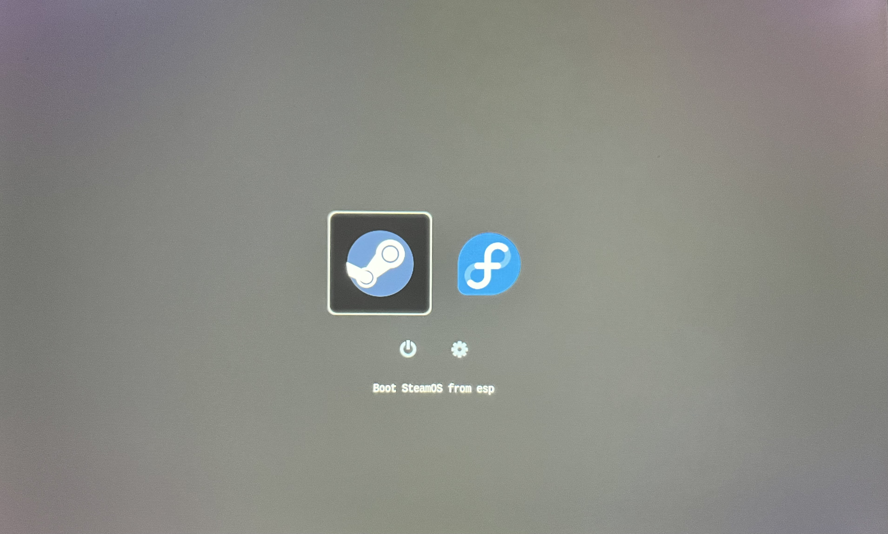

# Steam Deck rEFInd Installer

Get a nice boot menu on your dual (or more) booted Steam Deck. This is mainly for me since I don't want to have to manually do this again. Feel free to use/modify if you find it helpful for you. Feel free to submit issues or pull requests or a message if something is weird or you need it more suited for your Distro, more than happy to help.

## Usage
1. Clone this Repo and CD into this folder.
2. Run Command: `sudo ./install.sh` (You might need to give it exec privs first)
3. Reboot!

## Stuff to know if you use this
Touchscreen, D-PAD, and Buttons work. I disabled Mouse support on this config file (personal preference) uncomment line 213 of the conf file if you want it enabled.

I use Fedora, so you might need to edit `install.sh`, specifically line 29 to the correct flag (pacman doesn't use install) if you aren't using it. I might add it and just have it check for it, maybe, if I feel up to it.

Additionally, `refind_config_location` might need a different directory path. I'm unsure if Ubuntu/Debian/Arch/(Insert Distro Here) uses a different path, rEFInd on Fedora adds the 'refind' folder inside a created `efi` folder inside the `/boot/efi` folder (structure is `/boot/efi/efi/refind'), others might not.

Check the bottom of the refind.conf.deck file and you'll see my boot menu entries. I included an example boot entry, but it's pretty straight forward. 